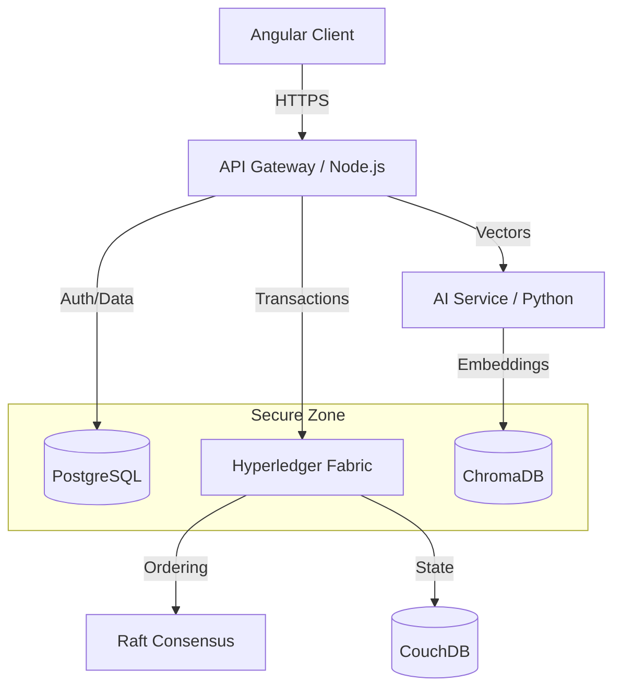

# LAKAM: Library Architecture for Keeping, Anti-Plagiarism, and Management

> **A Hybrid AI + Blockchain Integrated Library Services Platform**


[](https://github.com/lakam-org)
[](https://github.com/lakam-org)
[](LICENSE)
[](https://hyperledger-fabric.readthedocs.io)

---

## 🏛️ Mission Statement

**To modernize institutional repositories by enforcing academic integrity through immutable provenance and enhancing research discovery through semantic intelligence.**

LAKAM addresses the critical gap in legacy library systems: the inability to detect plagiarism accurately and the lack of transparent document lineage. By fusing **Hyperledger Fabric** for trust and **ChromaDB** for semantic understanding, LAKAM provides a secure, efficient, and defensible platform for the University of Makati.

---

## 🧩 System Overview

LAKAM enables **Polyglot Persistence**, leveraging the right data store for the right job:

1.  **PostgreSQL v17**: Relational data (users, metadata, logs).
2.  **Hyperledger Fabric v2.5**: Immutable ledger for document existence, ownership, and access logs.
3.  **ChromaDB**: Vector embeddings for high-precision semantic search and similarity detection.

### Core Value Proposition

*   **Immutable Provenance**: Every upload is hashed and recorded on a permissioned blockchain (Fabric). Tampering is mathematically impossible without detection.
*   **AI-Powered Anti-Plagiarism**: Pre-upload analysis checks cosine similarity against the entire vector database, flagging potential duplicates before they enter the repository.
*   **Semantic Discovery**: Researchers can use natural language queries (e.g., *"impact of AI on education"*) to find conceptually relevant documents, not just keyword matches.

---

## 🏗️ Architecture Overview

The system is composed of four primary dockerized microservices/layers:



### 1. Frontend Layer (`lakam-client`)
*   **Framework**: Angular 20+
*   **UI Library**: PrimeNG + Tailwind CSS
*   **Features**: Role-based dashboards, DRM-protected viewer (no-print, watermarking), visual analytics.

### 2. API Layer (`lakam-api`)
*   **Runtime**: Node.js v22
*   **Framework**: Express.js
*   **ORM**: Prisma
*   **Responsibility**: Orchestrates requests, manages JWT authentication, enforces rate limiting, and handles file uploads to S3/MinIO.

### 3. AI Service (`lakam-ai`)
*   **Runtime**: Python 3.13+
*   **Stack**: FastAPI + LangChain
*   **Responsibility**:
    *   **PDF Parsing**: Extracting text from uploaded thesis/dissertations.
    *   **Embedding Generation**: Converting text to vectors using `sentence-transformers`.
    *   **RAG Pipeline**: Generating document summaries on demand.

### 4. Blockchain Layer (`lakam-blockchain`)
*   **Platform**: Hyperledger Fabric v2.5
*   **Consensus**: Raft
*   **Chaincode**: Go (Golang)
*   **Responsibility**: Stores the "Source of Truth".
    *   `AssetCreate`: Maps Document ID to File Hash.
    *   `AccessLog`: Immutably records who viewed what and when.

---

## 📂 Repository Structure

The **lakam-org** ecosystem is organized into strictly scoped repositories:

| Repository | Purpose | Visibility |
| :--- | :--- | :--- |
| **[`lakam-client`](https://github.com/lakam-org/lakam-client)** | Angular frontend application source code. | Private |
| **[`lakam-api`](https://github.com/lakam-org/lakam-api)** | Backend API gateway and business logic. | Private |
| **[`lakam-ai`](https://github.com/lakam-org/lakam-ai)** | Artificial Intelligence microservice for embeddings & OCR. | Private |
| **[`lakam-blockchain`](https://github.com/lakam-org/lakam-blockchain)** | Fabric network config and Chaincode. | Private |
| **[`lakam-docs`](https://github.com/lakam-org/lakam-docs)** | PRD, ERD, and Architectural documentation. | Public/Private |
| **`.github`** | Organization profile and standards. | Public |

---

## 🎓 Academic Contribution & Defense Positioning

LAKAM is not just a software application; it is a **dissertation artifact** demonstrating the specific application of decentralized ledger technology in academic governance.

### Novelty
Integration of **Permissioned Blockchain** (Hyperledger) with **Vector Search** (RAG) in a single workflow. Most systems do one or the other; LAKAM does both to ensure integrity *and* discoverability.

### Defense Justifications
*   **Why Blockchain?** SQL databases can be altered by admins. Fabric provides a non-repudiable audit trail essential for degree verification and IP protection.
*   **Why Polyglot Persistence?** Storing full text on Blockchain is prohibitively expensive and slow. Storing hashes on chain + text in Vector DB + metadata in SQL optimizes for cost, speed, and trust simultaneously.
*   **Compliance**: Aligns with Data Privacy Act of 2012 (RA 10173) by keeping PII off-chain.

---

## 🛡️ Development Standards

We adhere to enterprise-grade engineering practices to ensure prototype scalability and reproducibility.

### Branching Strategy
*   `main`: Production-ready code. Locked.
*   `dev`: Integration branch.
*   `feat/feature-name`: Individual contribution branches.
*   **Rule**: No direct commits to `main` or `dev`. PRs required.

### Code Quality
*   **Commits**: Conventional Commits (e.g., `feat: user auth`, `fix: blockchain timeout`).
*   **Linting**: Strict ESLint/Prettier configuration.
*   **Docker**: All services must run via `docker-compose up`.

### Security Protocols
*   **Secrets**: No `.env` files committed. Use templates.
*   **Validation**: Zod/Joi for all backend inputs.
*   **Access**: Least-privilege principle for database users.

---

## 🚀 Getting Started

To spin up the entire LAKAM prototype locally:

1.  **Clone the Repository**
    ```bash
    git clone https://github.com/lakam-org/lakam-docs.git
    cd lakam-docs
    ```

2.  **Start Infrastructure**
    Ensure Docker Desktop is running.
    ```bash
    docker-compose up -d
    ```

3.  **Access Services**
    *   Frontend: `http://localhost:4200`
    *   API: `http://localhost:3000`
    *   Fabric Explorer: `http://localhost:8080`

---

## 🎨 Branding

*   **Primary Hunter Green**: `#344f1f`
*   **Amber Gold**: `#f4991a`
*   **Typography**: Inter (UI), Merriweather (Long-form content)

---

> **LAKAM** — *Veritas et Integritas via Technologia.*
